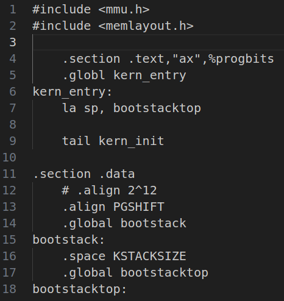
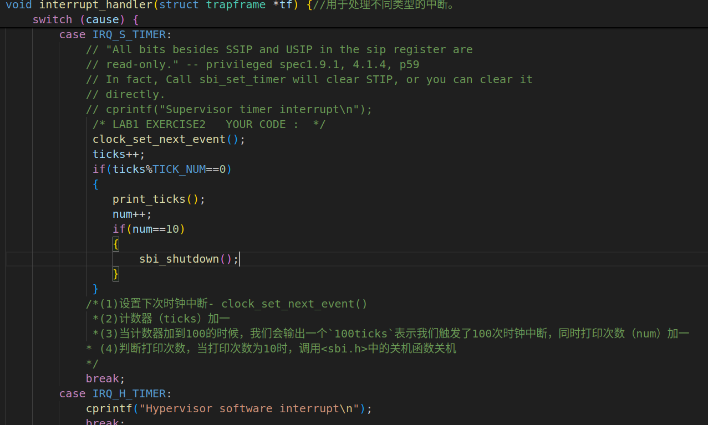
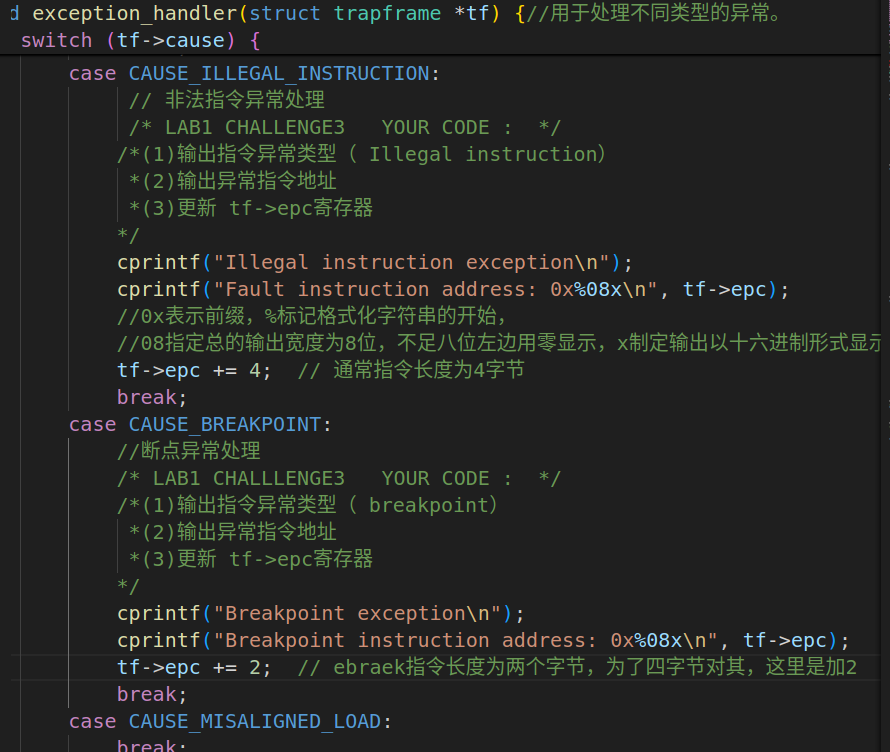

# Lab1
## 一.实验目的
实验1主要讲解的是中断处理机制。操作系统是计算机系统的监管者，必须能对计算机系统状态的突发变化做出反应，这些系统状态可能是程序执行出现异常，或者是突发的外设请求。当计算机系统遇到突发情况时，不得不停止当前的正常工作，应急响应一下，这是需要操作系统来接管，并跳转到对应处理函数进行处理，处理结束后再回到原来的地方继续执行指令。这个过程就是中断处理过程。

本章你将学到：
 - riscv 的中断相关知识
 - 中断前后如何进行上下文环境的保存与恢复
 - 处理最简单的断点中断和时钟中断
## 二.实验内容
实验1主要讲解的是中断处理机制。通过本章的学习，我们了解了 riscv 的中断处理机制、相关寄存器与指令。我们知道在中断前后需要恢复上下文环境，用 一个名为中断帧（TrapFrame）的结构体存储了要保存的各寄存器，并用了很大篇幅解释如何通过精巧的汇编代码实现上下文环境保存与恢复机制。最终，我们通过处理断点和时钟中断验证了我们正确实现了中断机制。
## 三.实验过程
### 1.练习1：理解内核启动中的程序入口操作
kern/init/entry.S的代码内容如下：



`kern/init/entry.S`: OpenSBI启动之后将要跳转到的一段汇编代码。在这里进行内核栈的分配，然后转入C语言编写的内核初始化函数。

#### （1）.`la sp, bootstacktop`
- 操作：这条指令使用la（Load Address）伪操作，将标签bootstacktop所表示的地址加载到栈指针寄存器sp中。（bootstacktop是预先在数据段中定义的标签，指向内核启动时使用的栈的顶部。）
- 目的：设置栈顶地址，为后续函数调用和栈操作提供正确的栈空间。在操作系统启动过程中，确保有一个有效的栈是非常重要的，因为后续的初始化代码和函数调用都需要使用栈来保存临时数据和返回地址。

#### （2）.`tail kern_init`
- 操作：tail是RISC-V汇编语言中的一个伪操作，用于实现函数的尾调用优化。这条指令跳转到kern_init函数，并传递当前函数的参数和链接信息。在RISC-V汇编中，tail指令实际上是一个跳转并链接（jump and link）指令，它将控制权转移给kern_init函数。
- 目的：跳转到内核的初始化函数kern_init，开始执行更高级的初始化工作。kern_init函数通常负责进行更深入的系统设置，包括内存管理、设备驱动初始化、调度器启动等。使用tail指令可以避免额外的函数调用开销，因为它直接将控制权转移给kern_init，而不是通过常规的函数调用方式。
### 2.练习2：完善中断处理
#### （1）.完善`trap.c`的实现

2213044 邓伟

根据注释中的提示，编写代码如上图。

#### （2）.定时器中断处理流程
最早的时钟中断位于`kern/init/init.c`中，如下：

`clock_init();  // init clock interrupt`

然后当定时器中断发生时，处理器会保存当前的执行状态到一个trapframe结构体中，并跳转到设置在stvec寄存器中的中断处理入口，及_alltraps()函数（它负责调用interrupt_handler()函数）。

interrupt_handler函数通过分析trapframe结构体中的cause字段来确定具体的中断类型，对于此实验的定时器中断，cause字段的值是IRQ_S_TIMER。
trapframe结构体如下：
```trap.h
struct trapframe {
    struct pushregs gpr;
    uintptr_t status;
    uintptr_t epc;
    uintptr_t badvaddr;
    uintptr_t cause;
};
```
然后当识别到IRQ_S_TIMER后，将执行我们所编写的代码，进行设置下次时钟中断，计数器加一等等操作。

处理完定时器中断后，中断处理程序会恢复处理器状态，并使用mret指令返回到中断发生前的执行点继续执行。
### 3.扩展练习Challenge1：描述与理解中断流程
#### （1）.ucore中处理中断异常的流程
- 捕获异常或中断：操作系统通过硬件机制捕捉到计算机运行时产生的异常或中断。
- 访问stvec寄存器：一旦发生异常或中断，处理器会自动访问stvec寄存器（该寄存器存储着中断处理程序的入口地址）。
stvec寄存器的最低两位，决定了如何处理中断和异常向量：最低两位为00，为直接模式，此时stvec 寄存器的高位直接存储中断或异常处理程序的入口地址；最低两位为01，为向量模式，stvec 寄存器的高位存储一个基地址，从这个基地址开始，处理器会根据异常或中断的类型（由 mcause 寄存器提供）跳转到对应的处理程序；
最低两位为10，为保留模式，此时这个值被保留，未来可能用于新功能；最低两位为11，也被保留，目前没有用途。这里是00情况。
- 设置中断入口点：将stvec的值设置为中断入口点__alltraps的地址。这个入口点是一段汇编代码，负责处理所有类型的异常和中断。
- 保存上下文：进入中断入口点后，操作系统使用SAVE_ALL汇编宏来保存当前的处理器状态，包括所有通用寄存器和程序计数器等，这些信息被保存在栈中，以便之后恢复。
- 分派处理：保存上下文后，控制权转移到trap()函数。在这个函数中，通过trap_dispatch()函数根据tf->cause的值（其中tf是指向trapframe的指针）来判断是中断还是异常。
如果是中断，调用interrupt_handler()函数；如果是异常，调用exception_handler()函数。
- 处理中断或异常：在interrupt_handler()或exception_handler()函数中，根据具体的异常类型或中断源执行相应的处理逻辑。
- 恢复上下文：处理完成后，执行__alltraps中的RESTORE_ALL汇编宏来恢复之前保存的寄存器值。
- 返回执行：最后，通过sret指令将sepc寄存器的值赋给程序计数器pc，从而从中断或异常返回，继续执行原来的程序。
#### （2）.特定问题
- `mov a0, sp`的目的：a0寄存器可用于传递参数给异常或中断处理函数。将sp的值复制到a0可以确保处理函数能够访问到保存在栈中的上下文信息，从而实现对中断的处理。
- SAVE_ALL中寄存器保存在栈中的位置：寄存器保存在栈中的位置是由栈指针sp确定的。在SAVE_ALL宏执行时，sp指向的位置就是第一个寄存器值被保存的地方，随后的寄存器值依次压栈。
- 是否需要在__alltraps中保存所有寄存器：是的，需要。因为中断与异常可以发生在程序执行的任何时刻，虽然全部保存会加深一定的开销，但是如果每次都根据实际的情况进行寄存器的选取保存的话，在代码方面会加深复杂性，并减少代码出问题的容错率，况且保存所有寄存器可以确保在处理完中断或异常后能够准确地恢复到原来的状态继续执行。
### 4.扩展练习Challenge2：理解上下文切换机制
#### （1）.csrw sscratch, sp；csrrw s0, sscratch, x0实现了什么操作，目的是什么？
- csrw sscratch, sp：将栈指针（sp）的当前值写入 sscratch 寄存器（在 RISC-V 中，sscratch 是一个系统寄存器，用于在异常或中断发生时保存用户模式下的栈指针）；其目的是，保留异常发生时用户栈的状态，以便在异常处理程序中能够访问用户栈。
- csrrw s0, sscratch, x0：读取 sscratch 寄存器的值到 s0 寄存器，然后将 x0 寄存器（通常用于保存零值）的值写回 sscratch 寄存器；其目的是，在异常处理程序开始时获取用户栈指针，并确保 sscratch 寄存器在处理程序中不会保留任何重要的值，避免被错误地使用。
#### （2）.`save all`里面保存了stval scause这些csr，而在`restore all`里面却不还原它们？那这样store的意义何在呢？
- `save all`中保存的意义：记录异常发生时的状态信息，这些信息对于异常处理程序来说是重要的上下文信息。
- `restore all`中不恢复的原因：对于scause来说，异常处理程序已经根据这个原因进行了处理，恢复这个值没有实际意义，而且可能会干扰后续的异常处理。对于styal来说，它保存的是导致故障的虚拟地址，在异常处理完成后，处理程序可能已经对这个地址进行了必要的操作（如访问修正或错误处理），恢复这个值还可能会导致混淆或错误。
- 这样store的意义：虽然恢复阶段不恢复这些特定的寄存器值，但是他们仍具有其意义，如保持上下文完整性，提供一些可选的恢复策略，记录日志等。
### 5.扩展练习Challenge3：完善异常中断
根据题目要求，编写代码如下：



2213044 邓伟

- 格式化字符串部分已在代码注释中讲解。
- `tf->epc`的加值不同，也已在注释中说明。
## 四，总结
此实验深入探讨了RISC-V架构下的中断处理机制，包括中断的捕获、中断帧（TrapFrame）的上下文保存与恢复、以及中断处理流程。通过实践，我了解并学会了如何设置内核栈、初始化中断向量、处理断点和时钟中断，并通过编写和完善中断服务例程，验证了中断机制的正确实现。
这些知识点对于我理解操作系统如何响应硬件事件和异常至关重要。
## 五，本实验的知识点
- 中断处理机制：操作系统必须能够响应硬件中断和软件异常，中断处理是操作系统核心功能之一。
- 上下文切换：在中断发生时，操作系统需要保存当前执行的上下文（如寄存器状态），以便中断处理完成后能够恢复到中断发生前的状态。
- 中断帧（TrapFrame）：用于在中断发生时保存CPU寄存器的状态，包括通用寄存器、程序计数器等。
- 中断向量表：操作系统通过中断向量表（IVT）来确定不同中断类型的处理程序。
- 中断服务例程（ISR）：当特定中断发生时，操作系统调用相应的中断服务例程来处理中断。
- 程序状态字（PSW）：在中断发生时，操作系统需要保存和恢复程序状态字，以确保CPU状态的正确性。