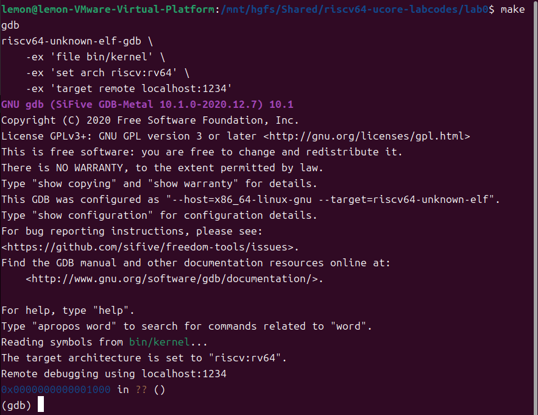
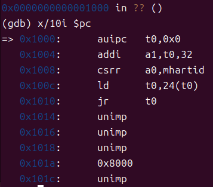
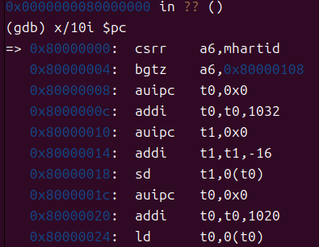
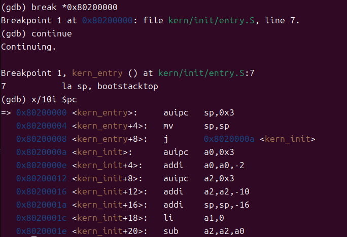

# Lab0.5
## 练习
### 一.实验目的
实验0.5主要讲解最小可执行内核和启动流程。
我们的内核主要在 Qemu 模拟器上运行，它可以模拟一台 64 位 RISC-V 计算机。
为了让我们的内核能够正确对接到 Qemu 模拟器上，需要了解 Qemu 模拟器的启动流程，
还需要一些程序内存布局和编译流程（特别是链接）相关知识,以及通过opensbi固件来通过服务。
### 二.实验过程
#### 练习1:使用GDB验证启动流程
##### Ⅰ 复位
为了熟悉使用qemu和gdb进行调试工作,使用gdb调试QEMU模拟的RISC-V计算机加电开始运行到执行应用程序的第一条指令（即跳转到0x80200000）这个阶段的执行过程，
说明RISC-V硬件加电后的几条指令在哪里？完成了哪些功能？要求在报告中简要写出练习过程和回答。

1.进入lab0中，分别打开两个终端，结合gdb和qemu源码，调试ucore：
```
make gdb
makd debug
```



make debug是一个自动化的构建和调试命令，它不仅编译程序，还启动 GDB 并执行一系列预设的调试命令。
从图中，我们可以看到RISC-V计算机首先停到了**0x1000**处（及PC首先被初始化为**0x1000**），这个地址通常被用作复位向量（系统加电或复位后的第一个跳转地址）。
这是因为实际上的RISC-V计算机在加电时，第一件事就是复位
在操作系统或嵌入式系统中，复位可能涉及到加载启动代码、初始化硬件设备、设置操作系统运行环境等。
而我们使用的QEMU模拟的这款riscv处理器的复位地址为**0x1000**，并不是**0x80000000**。

2.进入gdb后，利用指令`x/10i $pc`查看**0x1000**往后，即将执行的10条指令。



对图中显示的代码进行逐行分析：
- `auipc	t0,0x0`:将当前PC加上0x0，结果存在寄存器t0。
- `addi a1, t0, 32`:将寄存器t0的值加上0x32，结果存在寄存器a1。
- `csrr a0, mhartid`:读取mhartid CSR（Machine Hart ID）的值到寄存器a0。
- `ld t0, 24(t0)`:从寄存器t0偏移24个字节处加载一个双字（64位）到寄存器t0。
- `jr t0`:跳转到寄存器t0指示的地址（此时t0寄存器指示的地址就是**0x80000000**）。
- `unimp`:未实现指令。
- `0x8000`:直接的立即数。

这些就是RISC-V加电后的一部分指令，由QEMU的一段内在汇编代码负责。

然后在地址**0x1000**处，是RISC-V架构用于进行程序控制，加载和Bootloader的启动的。
我们就先用`si`指令，进行单步执行调试，直至最后通过`jr t0`跳转到对应的地方，启动Bootloader，进入下一步。

##### Ⅱ OpenSBI的启动 
进入到**0x80000000**后，查看其后即将执行的十条代码。



对图中显示的代码进行逐行分析：
- `csrr a6, mhartid`:从`mhartid`CSR（Control and Status Register）中读取硬件线程的ID，同时将结果存在寄存器a6中。
- `bgtz a6, 0x80000108`:如果a6寄存器的值大于零，则跳转到地址`0x80000108`处执行，否则继续执行下一条指令。
- `auipc t0, 0x0`:将当前指令的地址的高20位加上一个偏移量（0x0），同时将结果存在t0寄存器中。
- `addi t0, t0, 1032`:将t0寄存器的值加上1032，同时将结果存在t0寄存器中。
- `auipc t1, 0x0`:将当前指令的地址的高20位加上一个偏移量（0x0），同时将结果存在t1寄存器中。
- `addi t1, t1, -16`:将t1寄存器的值减去16，同时将结果存在t1寄存器中。
- `sd t1, 0(t0)`:将t1寄存器的值存到t0寄存器指定地址的内存位置上。
- `auipc t0, 0x0`:将当前指令的地址的高20位加上一个偏移量（0x0），同时将结果存在t0寄存器中。
- `addi t0, t0, 1020`:将t0寄存器的值加上1020，并将结果存在t0寄存器中。
- `ld t0, 0(t0)`:将t0寄存器指定地址的内存内容加载到t0寄存器。

这段代码主要涉及到硬件线程的识别和一些内存地址的计算与操作。
首先，它通过csrr指令获取当前硬件线程的ID，并根据这个ID决定是否跳转到特定的代码段执行。
接着，它使用auipc和addi指令计算特定的内存地址，并通过sd和ld指令在这些地址之间存储和加载数据。
这些操作能使处理器进入正确的状态以启动操作系统或其他应用程序。

之后，为了正确进行阶段对接，我们需要保证内核位于**0x80200000**处。
为此，我们需要先将内核镜像预先加载到Qemu物理内存以地址**0x80200000**开头的区域上。

##### Ⅲ 内核镜像的启动
使用指令`break *0x80200000`，提前在加载内核镜像的地方打断点，并运行到那里。


从这张照片上，我们可以看到在QEMU模拟器上运行的RISC-V系统的基本配置和安全设置。
通过OpenSBI，系统初始化了硬件资源，设置了内存保护，并且准备运行操作系统。



对图中显示的代码进行逐行分析：
- `auipc sp, 0x3`:设置栈指针sp。（auipc（Add Upper Immediate to PC）指令用于将程序计数器的高20位与一个立即数相加，生成一个地址。）
- `mv sp, sp`:将sp寄存器的值复制给sp寄存器，没有实际操作。
- `j 0x8020000a`:无条件跳转到地`0x8020000a`处执行。
- `auipc a0, 0x3`:将当前指令的地址的高20位加上一个偏移量（0x3），同时将结果存在a0寄存器中。
- `addi a0, a0, -4`:将a0寄存器的值减去4，同时将结果存在a0寄存器中。
- `auipc a2, 0x3`:将当前指令的地址的高20 位加上一个偏移量（0x3），并将结果存储在a2寄存器中。
- `addi a2, a2, -12`:将a2寄存器的值减去12，同时将结果存在a2寄存器中。
- `addi sp, sp, -16`:将sp寄存器的值减去16，同时将结果存在sp寄存器中，通常用于为新的栈帧分配空间。
- `li a1, 0`:将立即数0加载到a1寄存器。
- `sub a2, a2, a0`:将a2寄存器的值减去 a0 寄存器的值，并将结果存储在 a2 寄存器中。

这段代码，是执行了第一条指令（即kern entry）后的部分指令。
这些指令主要负责初始化内核的栈，设置寄存器值，并进行一些简单的算术操作。
它们是操作系统启动过程中的一部分，为后续的初始化和系统运行准备环境。

#### 总结
在本次实验中，我们通过使用GDB调试工具，来了解了QEMU模拟器上RISC-V计算机的启动流程。
首先，计算机在加电后，程序计数器（PC）被初始化到复位向量地址0x1000，而不是通常的0x80000000。
在0x1000地址处，执行了一系列指令，包括设置栈指针、加载硬件线程ID、以及跳转到启动代码的地址0x80000000。
这些指令由QEMU内置的汇编代码执行，为后续的启动代码加载和硬件设备初始化奠定了基础。
随后，通过利用GDB的x/10i $pc命令，查看并分析了0x80000000地址处的指令，这些指令主要负责进一步的硬件线程识别和内存地址计算。
特别是通过csrr指令获取硬件线程ID，并根据ID决定执行路径，以及使用auipc和addi指令进行内存地址的计算和数据的存取，这些操作为操作系统或其他应用程序的启动做好了准备。
最后，确保了内核镜像正确加载到物理内存的0x80200000起始地址，并在该地址设置了断点。
通过单步执行，我们观察到内核入口点处的指令，这些指令主要负责初始化内核栈、设置寄存器值，并执行一些基础的算术操作，为操作系统的进一步启动和运行准备了必要的环境。

### 三.重要知识点
- 复位向量：在RISC-V架构中，复位向量是系统加电或复位后CPU开始执行的起始地址。在QEMU模拟环境中，这个地址被设置为0x1000，用于初始化程序计数器（PC）。
- 启动流程：启动流程包括从复位向量开始执行的一系列初始化指令，这些指令负责设置栈指针、加载硬件线程ID，并跳转到更高地址处的启动代码（如0x80000000）。
- OpenSBI：OpenSBI（Open Source Supervisor Binary Interface）是RISC-V架构中用于初始化和运行操作系统的固件。它提供了硬件抽象层，允许操作系统与硬件进行交互。
- 内核镜像：内核镜像是操作系统的核心代码，它被编译并链接成一个可执行文件，然后在启动时加载到内存中。在本实验中，内核镜像被加载到0x80200000地址。
- 硬件线程识别：通过csrr指令读取mhartid寄存器来识别当前硬件线程（HART）的ID，这对于多核处理器的启动和初始化至关重要。
- 内存地址计算：使用auipc（Add Upper Immediate to PC）和addi（Add Immediate）指令进行内存地址的计算，为操作系统的启动代码和运行时环境准备内存。
- GDB调试：GDB（GNU Debugger）是一个强大的调试工具，它允许我们对程序进行逐行执行、设置断点、查看寄存器和内存状态等。在本实验中，我们使用GDB来验证和理解RISC-V计算机的启动流程。
- 内存布局：理解内存布局对于操作系统的启动至关重要。在本实验中，我们关注了内核镜像在物理内存中的加载位置，以及如何通过GDB查看和操作内存。
- 链接脚本：链接脚本定义了程序的内存布局，包括代码、数据和堆栈的位置。在本实验中，我们通过链接脚本确保内核镜像正确加载到预定的物理内存地址。


